Refer to the instructions on this site to ensure the success of Project 0 Presentations. Project 0 should be presented and recorded over Zoom. First, download and install the Zoom app on your Desktop. You can download Zoom app [here](https://www.zoom.us/download) then install it. Make sure you logged in to Zoom using the same email id that you’ve registered with Revature. 

Please adhere to the following steps:
  - [Record Project 0 Presentation using Zoom](./index.md#record-your-project-0-presentation)
  - [Upload recorded video to Google Drive](./index.md#upload-recorded-video-to-google-drive)
  - [Push your Project 0 code to GitHub](./index.md#push-your-project-0-code-to-github)
  - [Submit resources link for Review](./index.md#submit-resources-link-for-review)

## Record Project 0 Presentation using Zoom

- Open Zoom app and Click **New Meeting** to start an instant meeting.

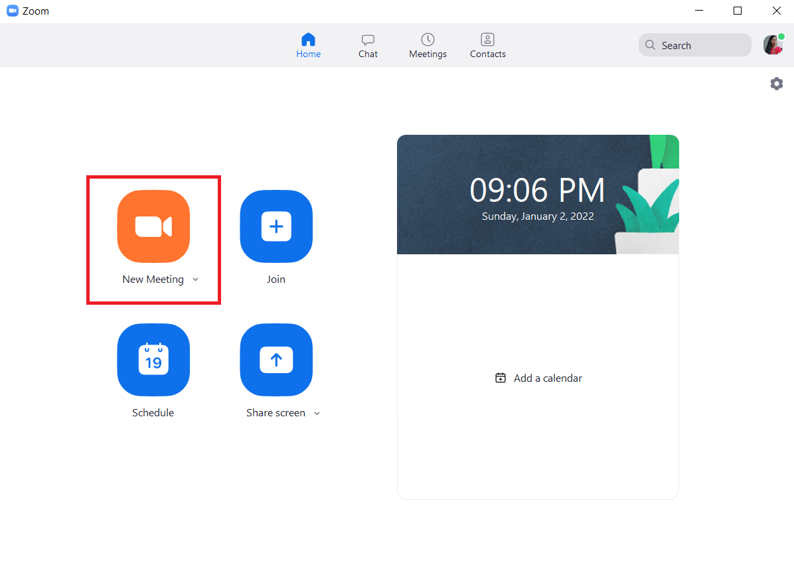

- After joining a Zoom meeting, you will be prompted to join the audio automatically. Now, Click **Join with Computer Audio**. Click on the **Start Video** at the bottom-right corner of the screen to switch ON your cam. Your camera and mic should be ON through out the presentation.

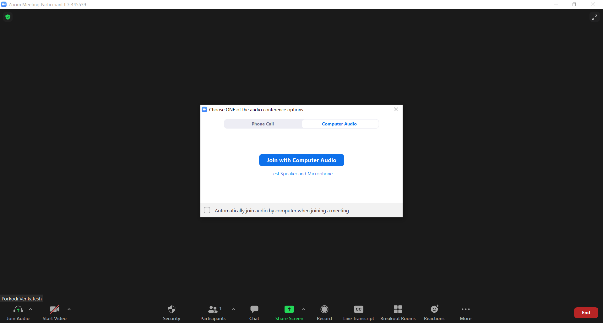

- Click on the **Record** button located at your meeting controls to start recording your presentation. 

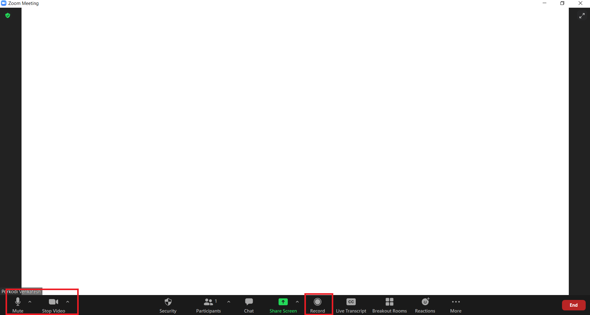

- You will see the recording indicator in the top-left corner while recording is active. After the meeting has ended, Zoom will convert the recording so you can access the files.

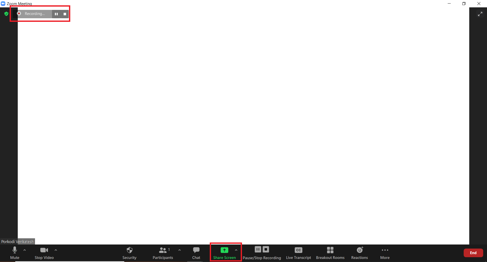

- Click **Share Screen** button located in your meeting controls and then Select **Screen** to share your entire screen for your presentation.

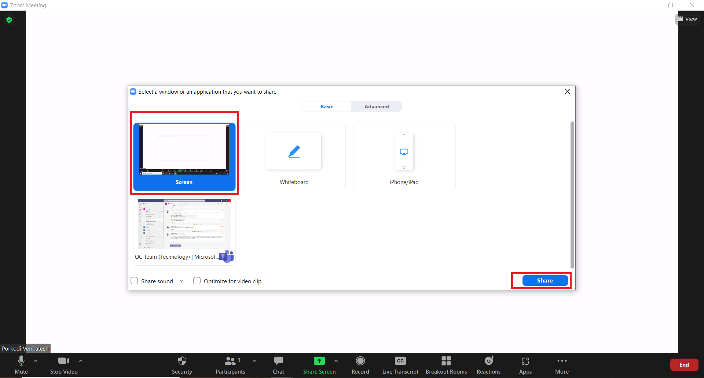

-  Now all set for you. You can go ahead and start your presentation.

Your Presentation should be  **atleast 5-10 mins** recorded video and adhere to the following instructions: 

  - Introduce yourself  
  - Detailly describe your Project 
  - Discuss tools & technologies used, design patterns implemented, and overall architecture considerations in this project
  - Include a live demo 
    - Showcase your code – You can talk about project structure & design patterns you’ve implemented (if any) 
    - Run your application and execute all the user stories you’ve implemented 
    - You should cover all user stories implemented in this Project in this recordings 
    - Run JUnit test cases you’ve implemented (if any) 
    - Showcase your Log file (if any) 
  - Discuss challenges you’ve during this project 
  - Discuss the ideas you’ve future enhancement (if you have)
  - Close your Project Presentation with a Thank you Note

After that, follow below steps to get your zoom recordings:

- Click on the **Stop Share** on your meeting controls to stop the screen sharing.

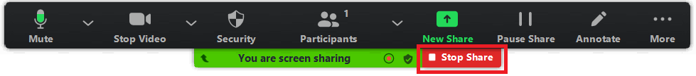

- To Stop recording, click on **Pause/Stop Recording** located at your meeting controls.

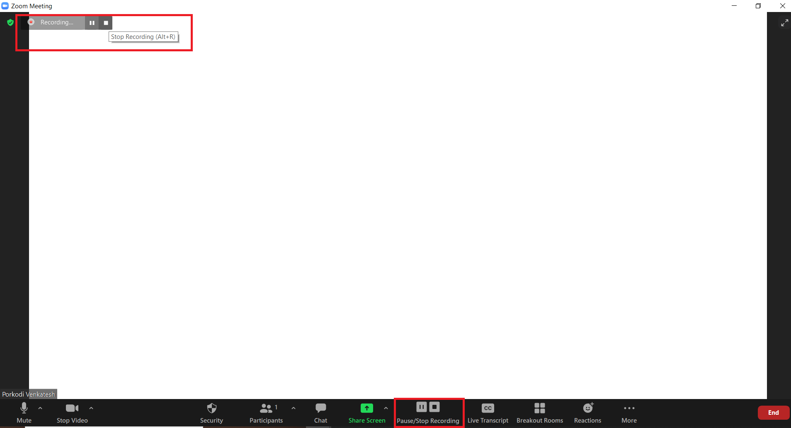

- Click **End** -> **End Meeting for all** to end the meeting. 

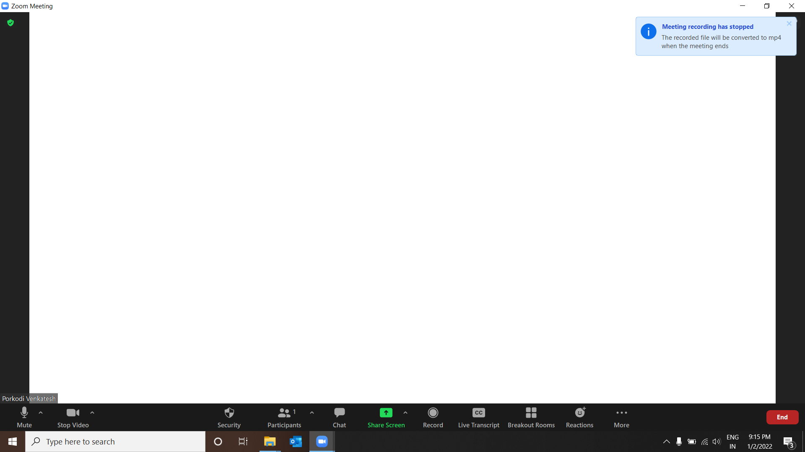

- Once you ended the meeting, **Convert Meeting Recording** windows pops up which converts your presentation into video recordings.

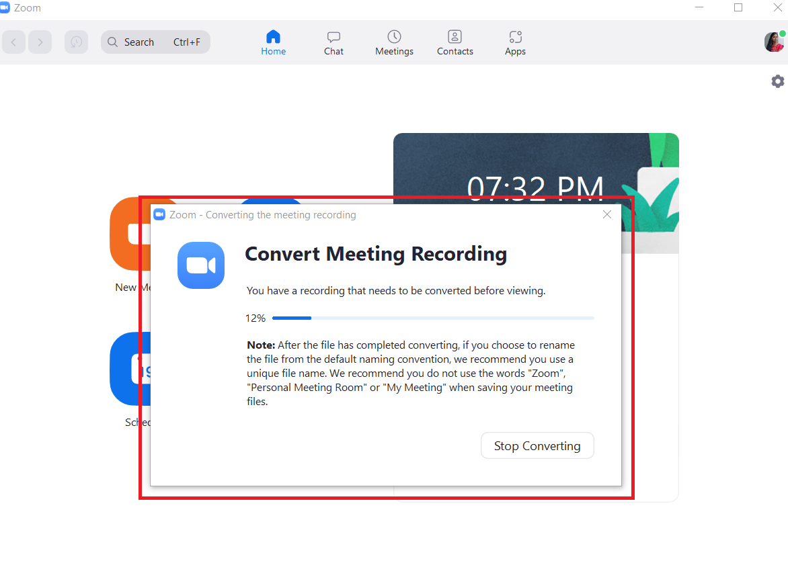

- When conversion is completed, your recording is saved on your desktop device to its own folder labeled with the date, time, and meeting name. By default, these folders are inside the Zoom folder, located inside the Documents folder on Windows, macOS, and Linux.

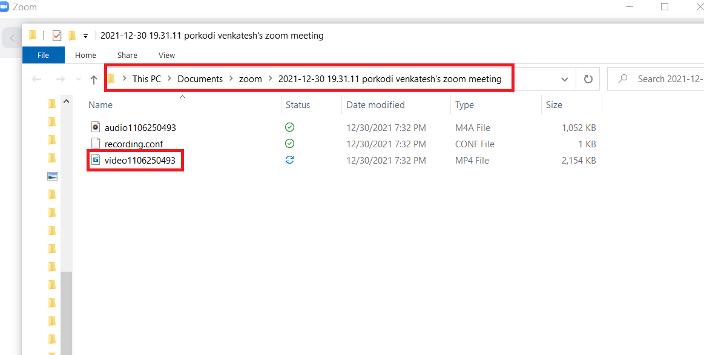

- Rename your video file to **Project 0 Presentation - Your_Full_Name**.

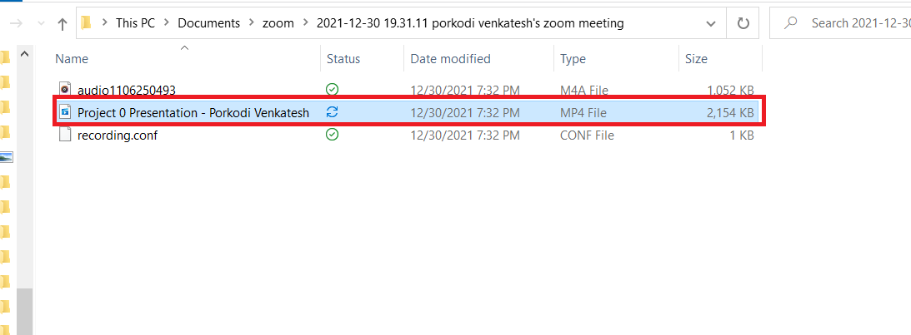

Now, your recording is ready. You can upload this video recording to Google Drive and submit it for review.

## Upload recorded video to Google Drive

To upload recorded video to Google Drive and create a shareable link, please adhere to the following steps:

- Go to [drive.google.com](https://drive.google.com/)
- At the top left, click **New** and then  **File Upload**.
- Choose the recorded video file (Project 0 Presentation - Your_Full_Name) to upload.

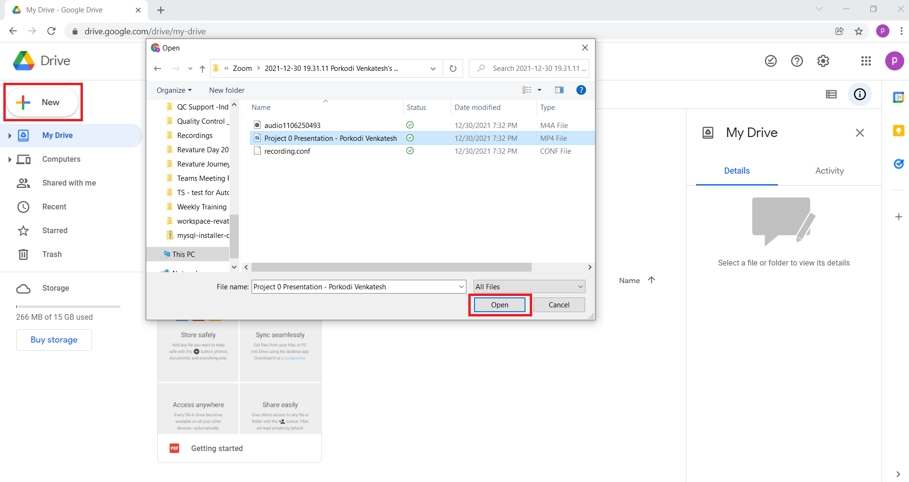

- Now, Right click on the uploaded recorded video file and select **Get link**

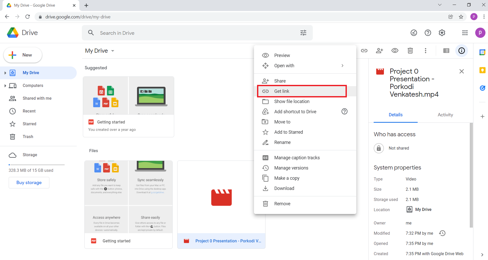

- Next to Restricted, there is a down arrow. Click on that down arrow and change the permissions from Restricted to **Anyone with the link**.

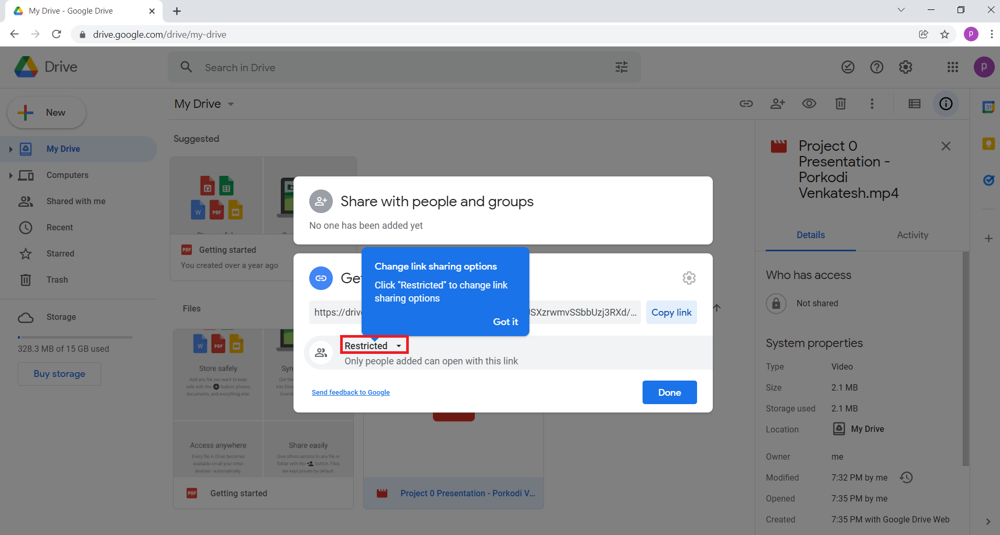

- Once Permission is updated, Click to the **Copy Link** to copy the shareable link to the Clipboard. Then, paste the link in the [Project 0 Submissions Form](https://forms.office.com/r/KNyE8qaezj).

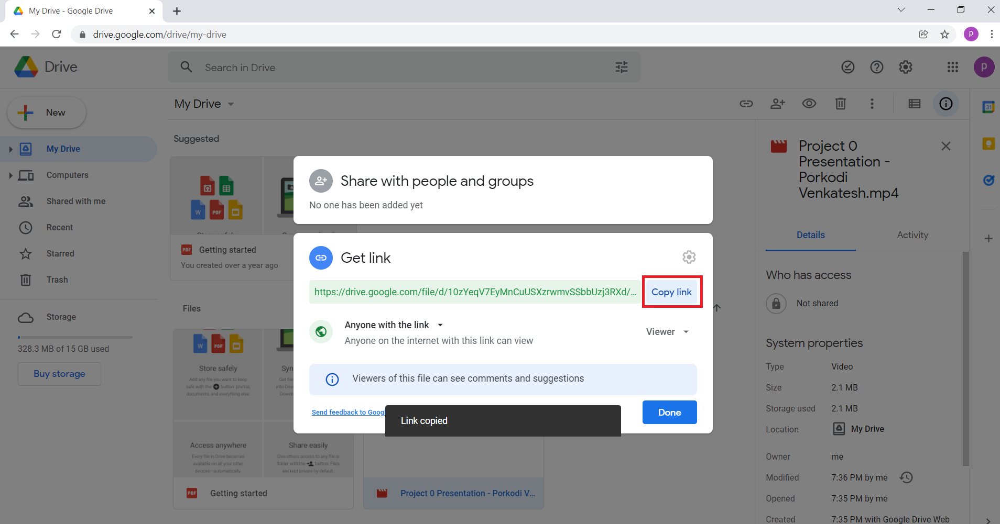

## Push your Project 0 code to GitHub

- In GitHub, Create a Public Repo with a Repo Name as your Project Name. 
- Push your properly documented project code to the repo. 
- Repo should have a README file with at least with - Title of the Project, An Explanation and Overview of the project, List of features implemented, Technologies used, how to set up / get started using it, and Usage of the project. You can have a look at the [Sample README.md file template](https://github.com/PorkodiVenkatesh/PROJECT-NAME) for your project documentation. 
- After the above steps, copy the Project Repo URL and paste the link in the [Project 0 Submissions Form](https://forms.office.com/r/KNyE8qaezj).

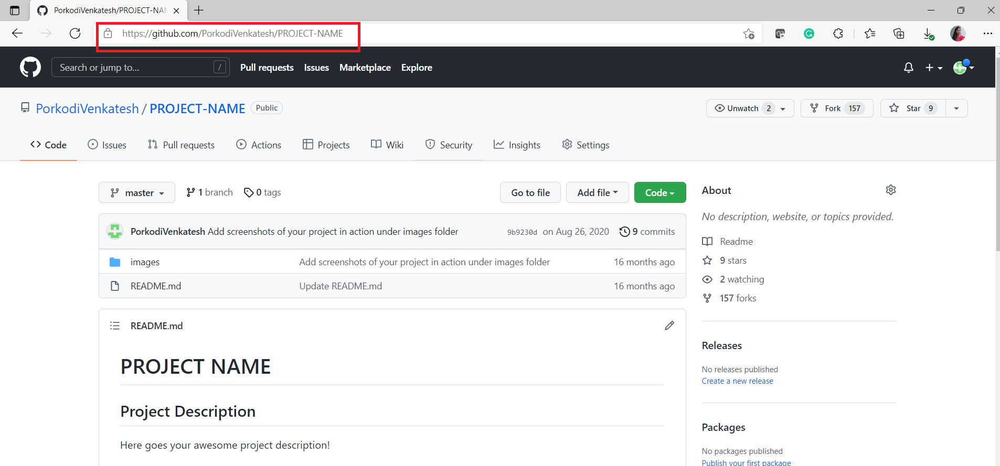

## Submit resources link for Review

Open the [Project 0 Submissions Form](https://forms.office.com/r/KNyE8qaezj) and fill all the required fields – Full Name, Email ID, Batch, Project 0 Title, Recorded Project 0 Presentation video link, and Project 0 Repo URL. Then, Submit the Form. 

After that QC team review your Recorded Project 0 Presentation video and your project code.  

All the Best!! 

 
 > *Feel free to email us at : [indiatrainingqc@revature.com](mailto:indiatrainingqc@revature.com) in case of any queries.*
