Refer to the instructions on this site to ensure the success of Project 0 Presentations. Project 0 should be presented and recorded over Microsoft Teams. First, download and install the Microsoft Team app for your Desktop. You can download Teams app [here](https://www.microsoft.com/en-in/microsoft-teams/download-app) then install it. Make sure you logged in Teams using the same email id that you’ve registered with Revature. 

Please adhere to the following steps:
  - [Record your Project 0 Presentation](./index.md#record-your-project-0-presentation)
  - [Push your Project 0 code to GitHub](./index.md#push-your-project-0-code-to-github)
  - [Submit resources link for Review](./index.md#submit-resources-link-for-review)

## Record your Project 0 Presentation

**1 ->** Open the Team app and Navigate to the **Calendar** tab on the left side

**2 ->** Press the **Meet Now** button

**3 ->** Change the Meeting Name to **Project 0 Presentation - Your_Full_Name**

**4 ->** Click on the **Start Meeting** button

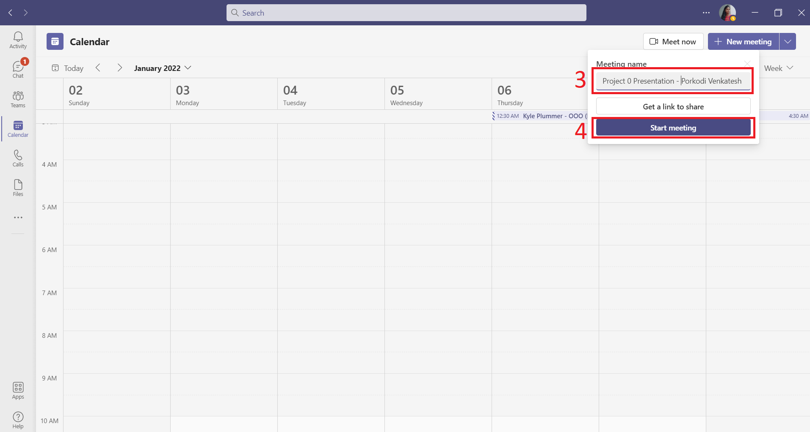

**5 ->** Then, You able to below Screen. Make sure Meeting Name is **Project 0 Presentation - Your_Full_Name**

**6 ->** Your camera should be ON throughout the Presentation 

**7 ->** Check your mic settings

**8 ->** Now, click on the **Join now** button

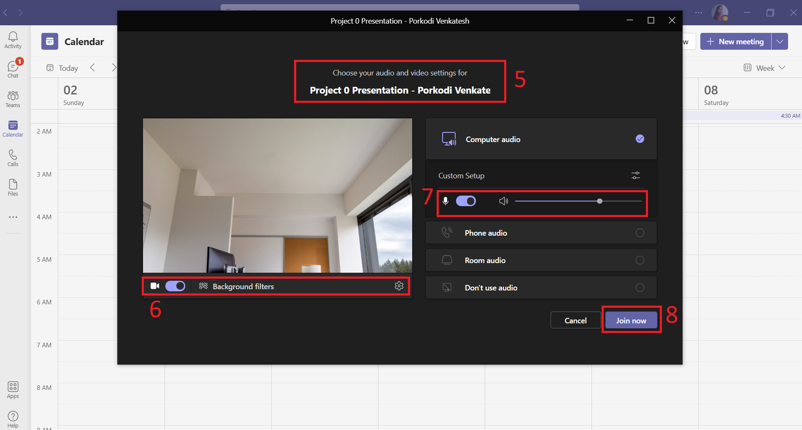

**9 ->** It may ask you to **Invite people to join you**. But you can just close that pop up window

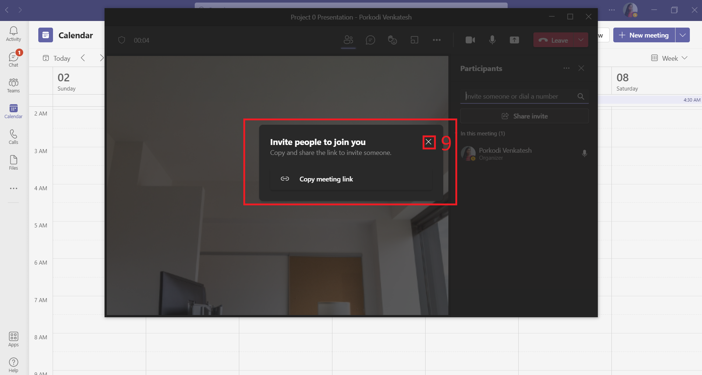

**10 ->** Click on **More actions**  button

**11 ->** Now, Select **Start recording**. Then, you got notified that recording and transcription have started

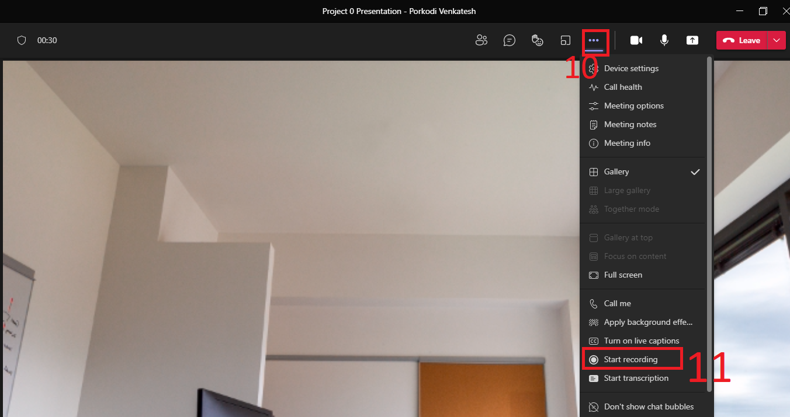

**12 ->** You can see recording has been started 

**13 ->** Select **Share content**  button 

**14 ->** Select **Screen** lets you share everything on your screen 

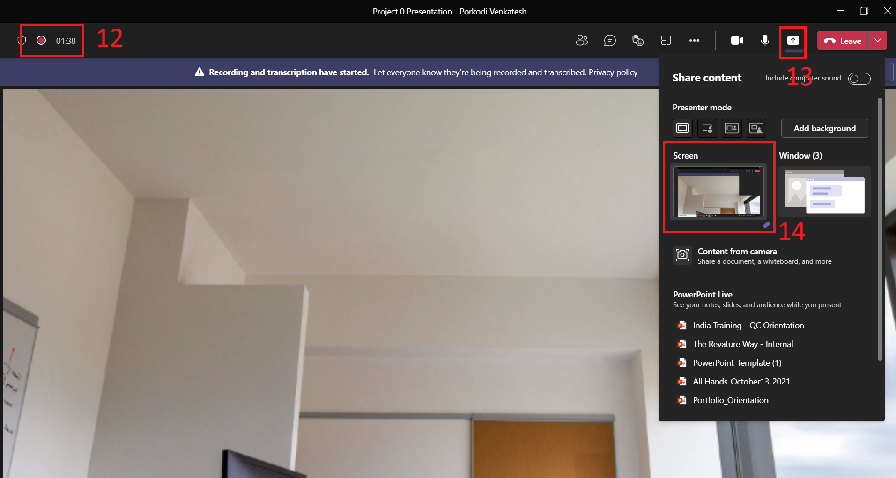

**15 ->** Now everything is all set. You can go start presenting your Project 0 

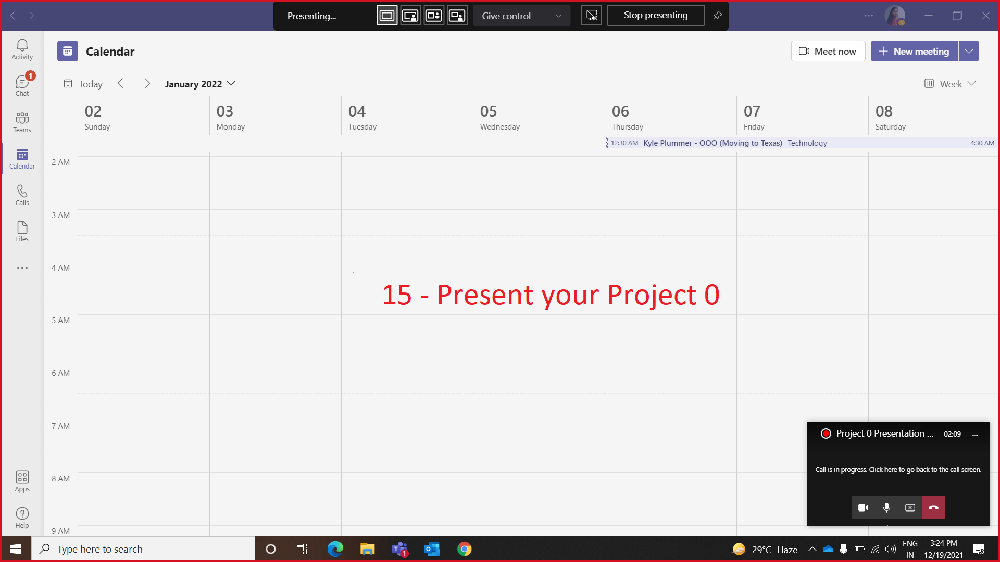

Your Presentation should be **5 to 10 mins** recorded video and adhere to the following instructions: 

  - Introduce yourself  
  - Detailly describe your Project 
  - Discuss tools & technologies used, design patterns implemented, and overall architecture considerations in this project
  - Include a live demo 
    - Showcase your code – You can talk about project structure & design patterns you’ve implemented (if any) 
    - Run your application and execute all the user stories you’ve implemented 
    - You should cover all user stories implemented in this Project in this recordings 
    - Run JUnit test cases you’ve implemented (if any) 
    - Showcase your Log file (if any) 
  - Discuss challenges you’ve during this project 
  - Discuss the ideas you’ve future enhancement (if you have)
  - Close your Project Presentation with a Thank you Note

After that, follow below steps to submit your recording:

**16 ->** Select **Stop Sharing** to stop showing your screen

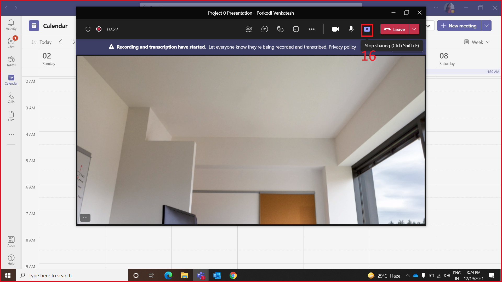

**17 ->** Click on **More actions**  button

**18 ->** Now, Select **Stop recording**

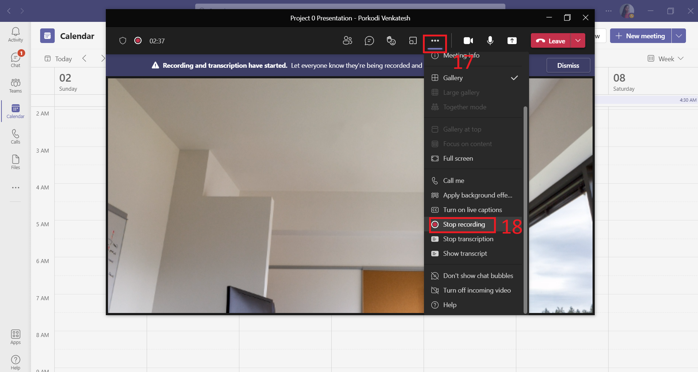

**19 ->** At last, you can end the meeting by clicking on the **Leave** button
 
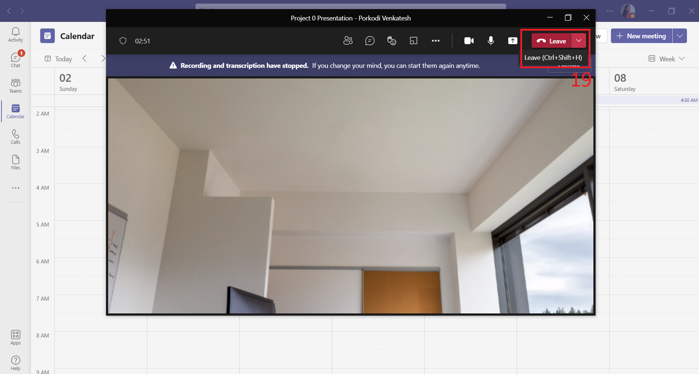

**20 ->** Navigate to the **Chats** tab on the left side. You can find the Meeting Recording in this chat - **Project 0 Presentation -  Your_Full_Name**

**21 ->** Now, you can see the recorded video. Click on **More actions**  button

**22 ->** Click on the **Open**

**23 ->** Click on the **Share** button in the player window

**24 ->** Click on  to change the share link settings

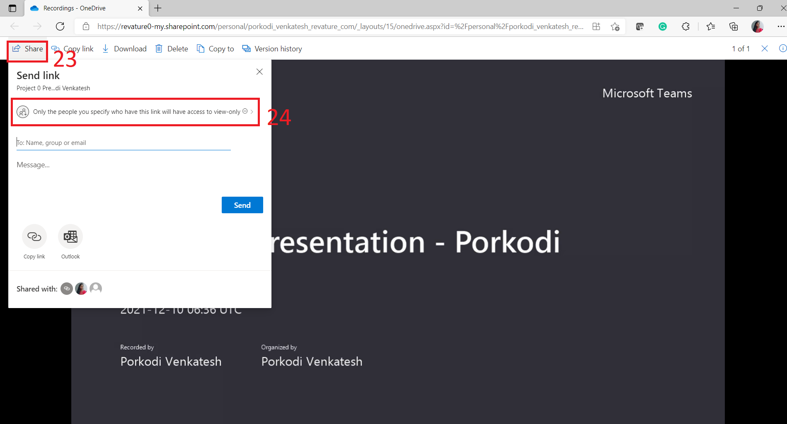 

**25 ->** Select the **Anyone with the link** in the Link settings menu

**26 ->** Click on the **Apply** button 

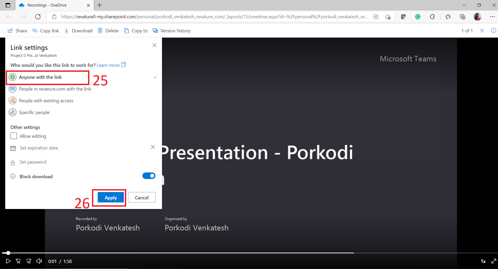

**27 ->** Click on the **Copy Link** Option to generate the shareable link.

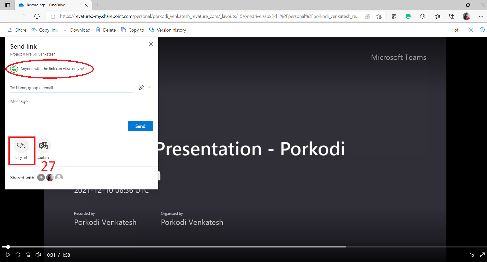

**28 ->** Click **Copy** button to copy the link to your clipboard. You should paste the same link in the [Project 0 Submission Form](https://forms.office.com/r/KNyE8qaezj).

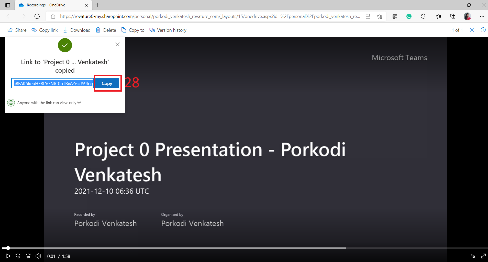

## Push your Project 0 code to GitHub

- In GitHub, Create a Public Repo with a Repo Name as your Project Name. 
- Push your properly documented project code to the repo. 
- Repo should have a README file with at least with - Title of the Project, An Explanation and Overview of the project, List of features implemented, Technologies used, how to set up / get started using it, and Usage of the project. You can have a look at the [Sample README.md file template](https://github.com/PorkodiVenkatesh/PROJECT-NAME) for your project documentation. 
- After the above steps, copy the Project Repo URL and paste the link in the [Project 0 Submission Form](https://forms.office.com/r/KNyE8qaezj).

## Submit resources link for Review

Open the [Project 0 Submission Form](https://forms.office.com/r/KNyE8qaezj) and fill all the required fields – Full Name, Email ID, Batch, Project 0 Title, Recorded Project 0 Presentation video link, and Project 0 Repo URL. Then, Submit the Form. 

After that QC team review your Recorded Project 0 Presentation video and your project code.  

All the Best!! 

 
 > *Feel free to email us at : [indiatrainingqc@revature.com](mailto:indiatrainingqc@revature.com) in case of any queries.*
