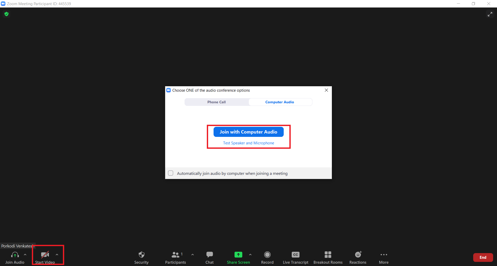
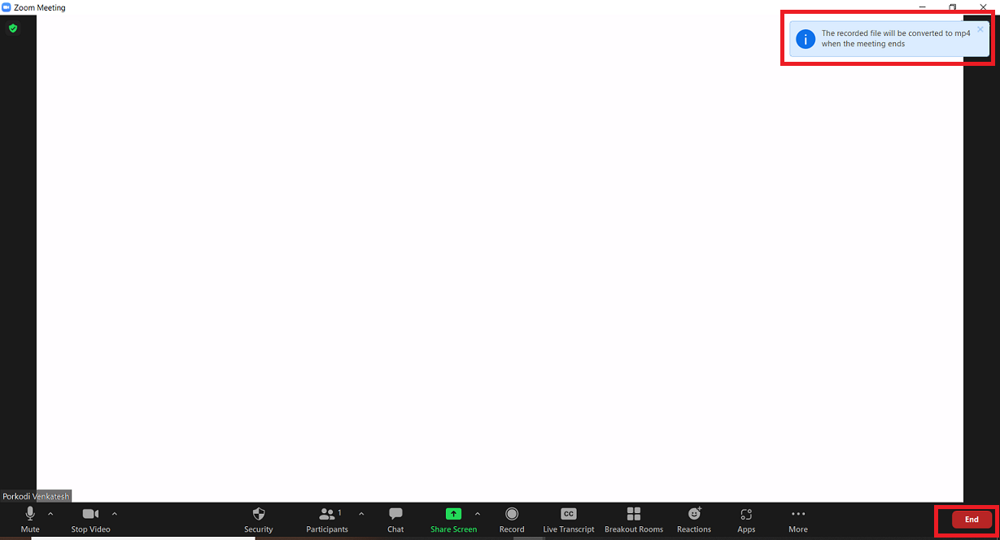
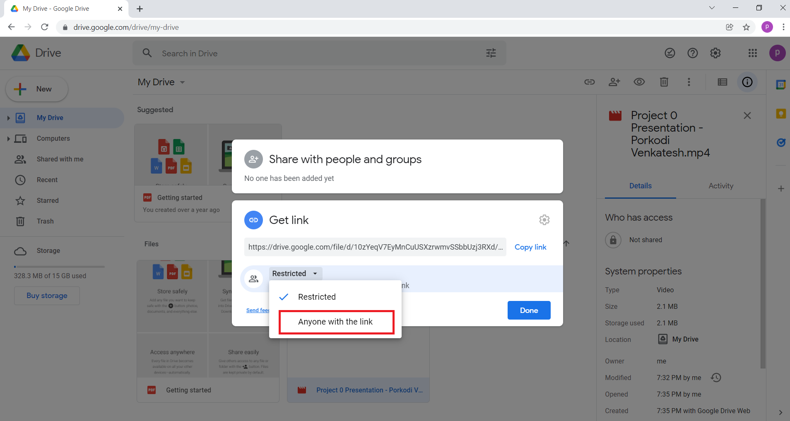

Kindly refer to the instructions on this site to ensure the successful submission of your Project 0 Presentation. Project 0 needs to be recorded and presented over Zoom.  

First, download and install the Zoom app on your Desktop. You can download Zoom app [here](https://www.zoom.us/download) and then install it according to the installation instructions. Make sure you sign up and login to Zoom using the same email id that you’ve registered with Revature.  
 

Following are the steps to submit your project 0 presentation: 

  - [Record Project 0 Presentation using Zoom](./index.md#record-your-project-0-presentation) 

  - [Upload the recorded video to Google Drive](./index.md#upload-recorded-video-to-google-drive) 

  - [Push your Project 0 code to GitHub](./index.md#push-your-project-0-code-to-github) 

  - [Submit resources link for the Review](./index.md#submit-resources-link-for-review) 

 
 

## Record Project 0 Presentation using Zoom 

 

- Open Zoom app and Click **New Meeting** to start an instant meeting. 

 
 

 

 
 

- After joining a Zoom meeting, you will be prompted to join the audio automatically. Now, Click **Join with Computer Audio**. Then, click on the **Start Video** at the bottom-left corner of the screen to switch ON your camera. Your camera and mic should be ON throughout the presentation. 

 
 

 

 
 

- Click on the **Record** button that must be selected from your meeting controls to start recording your presentation.  

 
 

 

 
 

- Once you click on the Record button, you will see a red dot as a recording indicator in the top-left corner to indicate that the recording is active. Once you are done with your recording, Zoom will convert the recording and you can access the files. 

 
 

 

 
 

- To share your screen to present your project 0 presentation, click **Share Screen** button located in your meeting controls and then Select **Screen** option to share your entire screen for your presentation. 

 
 

 

 

-  Now all set for you. You can go ahead and start your presentation. 
 

Your Presentation should be **at least 5-10 mins** recorded video. Please adhere to the following instructions while you record the video for your presentation: 

  - Start by introducing yourself   

  - Describe your Project in detail 

  - Discuss tools & technologies used, design patterns implemented, and overall architecture considerations in this project 

  - Showcase the ER diagram and talk about the relationshiop between your tables in the database

  - Include a live demo  

    - Showcase your code – You can talk about project structure & design patterns you’ve implemented (if any)  

    - Run your application and execute all the user stories you’ve implemented  

    - You should cover all user stories implemented in this Project in this recordings  

    - Run JUnit test cases you’ve implemented (if any)  

    - Showcase your Log file (if any)  

  - Discuss the challenges you have faced during this project  

  - Discuss the ideas of future enhancement (if you have)  

  - Close your Project Presentation with a Thank you Note 

 
 

Once you are done with the recording, follow the steps given below to get your recordings from Zoom: 

 
 

- To begin with, Click on the **Stop Share** on your meeting controls to stop the screen sharing. 

 
 

 

 
 

- Next, To Stop recording, click on **Pause/Stop Recording** located at your meeting controls. 

 
 

 

 
 

- Then, Click **End** -> **End Meeting for all** to end the meeting.  

 
 

 

 
 

- Once you end the meeting, a window **Convert Meeting Recording** pops up which converts your presentation into video recordings. 

 
 

 

 
 

- When the conversion is completed, your recording is saved on your desktop device to its own folder labeled with the date, time, and meeting name. By default, these folders are inside the Zoom folder, located inside the Documents folder on Windows, macOS, and Linux. 

 
 

 

 
 

- Once the conversion is completed and the recorded file is located, rename your video file to **Project 0 Presentation - Your_Full_Name**. 

 
 

 

 
 

Now, your recording is ready. You can upload this video recording to Google Drive and submit it for review. 

 
 

## Upload the recorded video to Google Drive 

Kindly adhere to the following steps to upload your recorded video to Google Drive and to create a shareable link. 

 
 

- Go to [drive.google.com](https://drive.google.com/) 

- At the top left, click **New** and then click **File Upload**. 

- Choose the recorded video file (Project 0 Presentation - Your_Full_Name) to upload. 

 
 

 

 
 

- Now, Right click on the uploaded recorded video file and select **Get link** 

 
 

 

 
 

- To change the access permissions, Click on the down arrow next to **Restricted** and change the permissions from Restricted to **Anyone with the link**.(This allows the reviewer to view the uploaded recorded file without any access required) 

 
 

 

 
 

- Once the access permission is updated, Click to the **Copy Link** to copy the shareable link to the Clipboard. Then, paste the link in the [Project 0 Submissions Form](https://forms.office.com/r/KNyE8qaezj). 

 
 

 

 
 
 

## Push your Project 0 code to GitHub 

 
 

- In GitHub, Initially, Create a Public Repository with the Repository Name as your Project Name.  

- Now, Push your properly documented project code to the repository.  

- The Repository should have a README file that contains the details about your Project 0 like Title of the Project, An Explanation and Overview of the project, List of features implemented, Technologies used, how to set up / get started using it, and Usage of the project.  

You can have a look at the [Sample README.md file template](https://github.com/PorkodiVenkatesh/PROJECT-NAME) for your project documentation.  

- After the above steps are completed, copy the Project Repo URL and paste the link in the [Project 0 Submissions Form](https://forms.office.com/r/KNyE8qaezj). 

 
 

 

 
 

## Submit resources link for the Review 

 
 

To begin with, Open the [Project 0 Submissions Form](https://forms.office.com/r/KNyE8qaezj) and fill all the required fields like Full Name, Email ID, Batch, Project 0 Title, Recorded Project 0 Presentation video link, and Project 0 Repo URL. Once all the required fields are filled, submit the Form.  

 
After completing all the above steps, the QC team would review your recorded Project 0 presentation video and the project code.  

 

All the very best!!  

 
 

  

 > *In case of any queries, please feel free to email us at : [indiatrainingqc@revature.com](mailto:indiatrainingqc@revature.com) 

 
 

 
